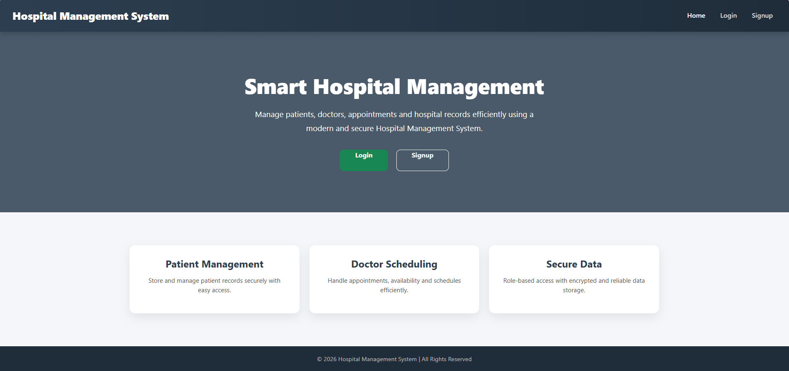
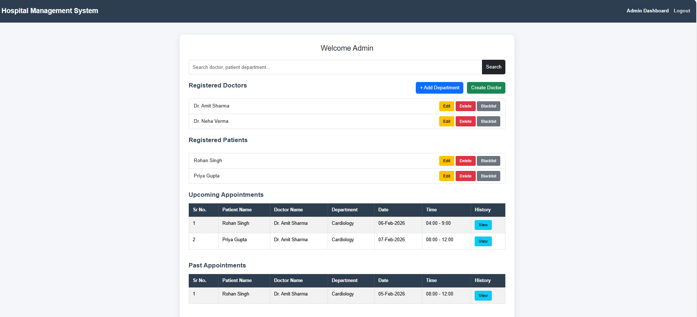
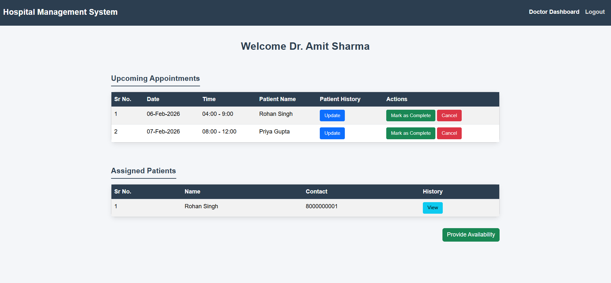
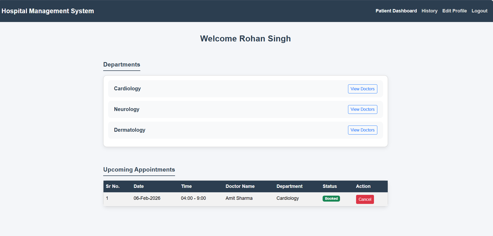

# Hospital Management System (HMS)

Hospital Management System (HMS) is a **Flask-based web application** that helps manage hospital activities like doctors, patients, appointments, and treatments in an organized and role-based way.

This project mainly focuses on **backend logic, modular Flask structure, and smooth workflows**, replacing manual registers and scattered systems with a simple and reliable digital solution.

---

## Project Objective

- Digitize core hospital management processes
- Implement secure, role-based access control
- Design a modular and scalable Flask application
- Handle appointments, patient records, and treatments efficiently
- Follow best practices for local development and database management

---

## User Roles & Functionalities

### Admin (Hospital Staff)
- Acts as the pre-existing superuser
- Create hospital departments
- Create, update, delete and block doctor profiles
- View and monitor all appointments
- Manage patient profiles (view, update, block)
- Search doctors and patients by name or specialization

### Doctor
- View assigned appointments
- Update availability status
- Cancel assigned appointments when required
- Mark patient visits as completed
- Add diagnosis and treatment notes
- View patient medical history

### Patient
- Register and log in securely
- View doctor profiles and available appointment slots
- Book or cancel appointments
- View appointment history and treatment details

---

## Tech Stack

- **Backend:** Flask (Python)
- **Frontend:** Jinja2, HTML, CSS, Bootstrap
- **Database:** SQLite (created programmatically)
- **Architecture:** Modular Flask design
- **Environment Management:** python-dotenv

---

## Project Highlights

- Modular Flask architecture for clean and maintainable code
- Clear separation of routes, models, and configuration files
- Role-based dashboards for Admin, Doctor, and Patient
- Secure authentication with password hashing
- Database created programmatically using ORM models (no manual DB tools)
- Appointment workflow with availability-based booking
- Fully runnable and testable on a local development environment

---

## Application Screenshots

### Home Page


### Admin Dashboard


### Doctor Dashboard


### Patient Dashboard


---

## Project Structure

```text
hospital-management-system/
│
├── application/
│   ├── __init__.py        # Application package initializer
│   ├── controllers.py     # Route and controller logic
│   ├── database.py        # Database configuration and setup
│   └── models.py          # Database models
│
├── screenshots/           # Application screenshots
│
├── templates/             # Jinja2 HTML templates
│
├── .gitignore
├── app.py                 # Application entry point
├── config.py              # Application configuration
├── requirements.txt       # Project dependencies
└── README.md              # Project documentation
